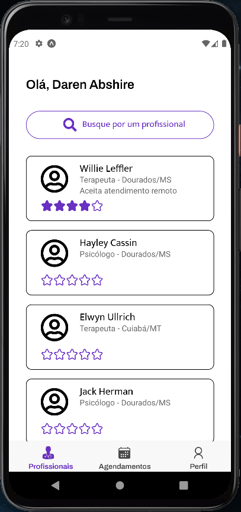
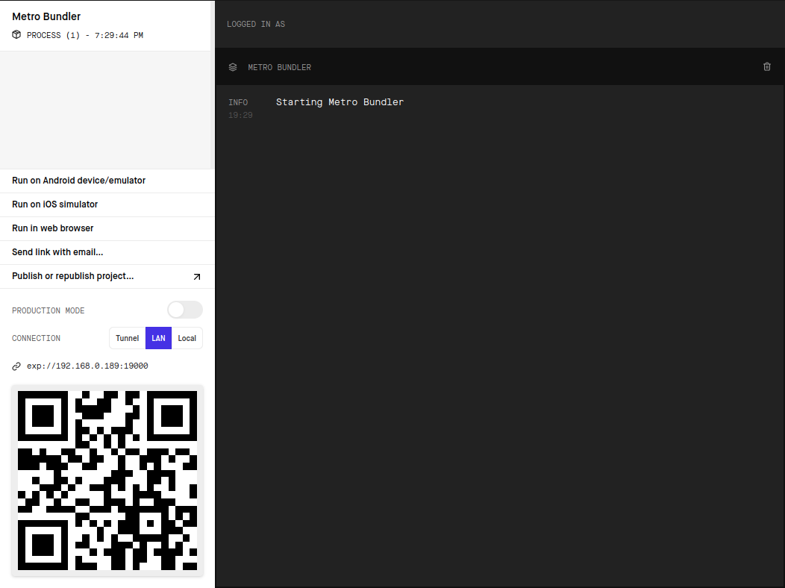

# Assistência Domiciliar


Este repositório trata-se de um aplicativo mobile que viabiliza o atendimento domiciliar. A proposta é permitir que pacientes e profissionais possam se conectar por meio de dispositivos móveis e promover um atendimento mais humanizado.

De modo geral o profissional pode cadastrar sua especialidade e tipo de atendimento (Presencial ou Remoto). Enquanto que o paciente pode buscar por um profissional e solicitar um agendamento. Para cada atendimento concluído o paciente pode registrar uma avaliação. Desta forma, além do agendamento, o aplicativo pode servir como uma rede de comunicação no qual pacientes podem simplesmente utilizá-lo para obter contato de profissionais com boa avaliação.

# Screenshot



# Pré-requisitos

- [NodeJS (versão 14 ou superior)](https://nodejs.org/en/)
- [Yarn (versão 1.22 ou superior)](https://yarnpkg.com/)

# Tecnologias

- [React Native](https://reactnative.dev/)
- [Firebase](https://firebase.google.com/)
- [styled-components](https://styled-components.com/)

# Como executar

**Clonar projeto**

```bash
git clone https://github.com/marlenesedano/assistencia-domiciliar-mobile
```

**Acessar diretório**
```bash
cd assistencia-domiciliar-mobile
```

**Instalar dependências**
```bash
yarn install
```

**Executar aplicação**

```bash
expo start
```

Ao executar o comando acima, a seguinte página será aberta:



> Caso a página não abra  automaticamente acesse o seguinte endereço no browser de sua preferência: http://localhost:19002

Para iniciar o aplicativo, você tem duas opções:

1. Instalar o aplicativo [Expo](https://docs.expo.dev/) no [Android](https://play.google.com/store/apps/details?id=host.exp.exponent) ou [IOS](https://apps.apple.com/br/app/expo-go/id982107779).
    - abrir o aplicativo
    - escanear o QR Code
2. Instalar e iniciar algum emulador Android/IOS.
    - selecionar opção "**Run on Android device/emulator**" no menu lateral.

# Como executar os testes

**Executar Testes Unitários**

```bash
yarn test
```
